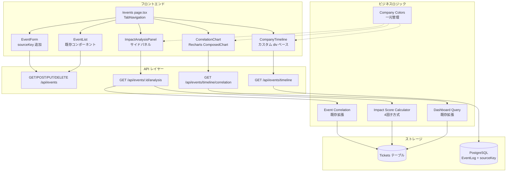
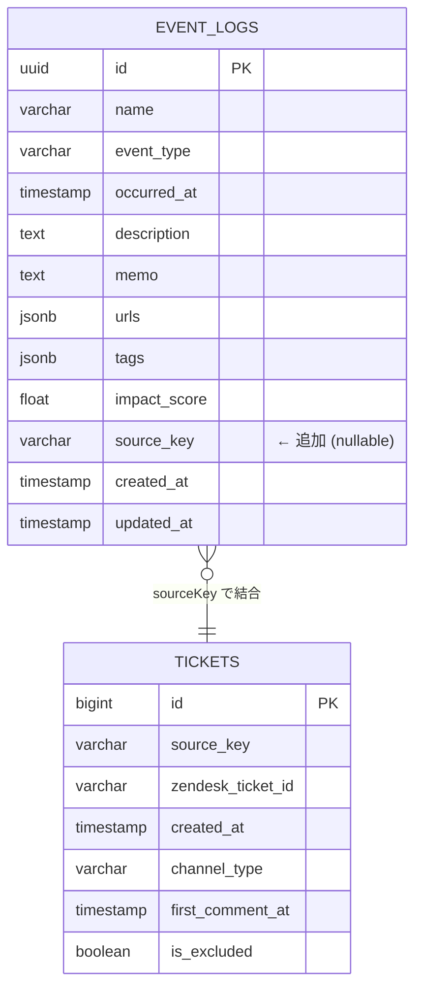

# 技術設計書: Event Timeline Dashboard

## Overview

既存のイベント管理画面（`/events`）を拡張し、会社別イベントタイムライン・チケット/コール数相関グラフ・影響分析パネルを統合したダッシュボードを構築する。

現在の `/events` ページは EventList + EventForm + EventDetail の単純な一覧画面だが、これをタブベースの3画面構成（タイムライン / 一覧 / 相関分析）に拡張する。EventLog モデルに `sourceKey` フィールドを追加し、イベントを会社単位で管理可能にする。Impact Score 算出ロジックをコール数・異常検知フラグを含む4因子方式に拡張する。

### 設計方針

- **既存コンポーネント再利用**: EventList, EventForm, EventDetail は「一覧」タブ内でそのまま利用
- **カスタム Timeline**: Recharts はガントチャートに不向きなため、div ベースのカスタム実装
- **Recharts ComposedChart**: 相関グラフは既存の Recharts を活用（Bar + Line + ReferenceLine）
- **会社カラー一元管理**: `src/lib/company-colors.ts` に Tailwind クラスと hex 値を集約し、ダッシュボード・イベント画面で共有
- **段階的拡張**: metrics 配列・additionalMetrics フィールドで将来のメール配信数・LINE数等に対応

## Architecture

### システム構成



### タブ構成

| タブ | コンテンツ | 主要コンポーネント |
|------|-----------|-------------------|
| タイムライン | ガントチャート風タイムライン + ミニ相関グラフ | CompanyTimeline, CorrelationChart (mini) |
| 一覧 | 既存のイベント一覧・登録・詳細 | EventList, EventForm, EventDetail, PredictionBanner |
| 相関分析 | タイムライン(上) + 相関グラフ(下) + 影響分析パネル(右) | CompanyTimeline, CorrelationChart, ImpactAnalysisPanel |

### 共有ステート

タブ間で以下の状態を共有し、タブ切り替え時に保持する:

- `dateRange: { startDate: string; endDate: string }` — 日付範囲フィルタ
- `selectedEvent: EventLog | null` — 選択中のイベント
- `sourceKeyFilter: string | null` — 会社フィルタ

## Components and Interfaces

### 1. Company Colors 一元管理 (`src/lib/company-colors.ts`)

```typescript
export interface CompanyColorConfig {
  key: string;        // sourceKey (e.g. "starservicesupport")
  name: string;       // 表示名 (e.g. "STAR")
  tailwind: {
    bg: string;       // "bg-orange-500"
    border: string;   // "border-orange-500"
    text: string;     // "text-white"
    badge: string;    // "bg-orange-500"
  };
  hex: string;        // "#f97316" (Recharts 用)
}

export const COMPANY_COLORS: Record<string, CompanyColorConfig>;
export const ALL_COLOR: CompanyColorConfig;
export const DEFAULT_COLOR: CompanyColorConfig; // 未登録会社用グレー

export function getCompanyColor(sourceKey: string | null): CompanyColorConfig;
export function getCompanyName(sourceKey: string | null): string;
```

カラーマッピング:
| sourceKey | 表示名 | Tailwind | Hex |
|-----------|--------|----------|-----|
| starservicesupport | STAR | bg-orange-500 | #f97316 |
| dmobilehelp | JTBC | bg-pink-500 | #ec4899 |
| jcnhelp | JCN | bg-indigo-800 | #3730a3 |
| mpcahelp | MPCA | bg-emerald-600 | #059669 |
| null / "ALL" | 全社 | bg-blue-600 | #2563eb |
| その他 | — | bg-gray-400 | #9ca3af |

### 2. TabNavigation コンポーネント

```typescript
type TabId = 'timeline' | 'list' | 'correlation';

interface TabNavigationProps {
  activeTab: TabId;
  onTabChange: (tab: TabId) => void;
}
```

3つのタブ: 「タイムライン」「一覧」「相関分析」。クライアントサイドの状態切り替えのみ（ページ遷移なし）。

### 3. CompanyTimeline コンポーネント

```typescript
interface TimelineEvent {
  id: string;
  name: string;
  eventType: EventType;
  occurredAt: string;
  sourceKey: string | null;
  impactScore: number | null;
}

interface CompanyTimelineProps {
  events: TimelineEvent[];
  companies: CompanyColorConfig[];
  dateRange: { start: Date; end: Date };
  onEventClick: (event: TimelineEvent) => void;
  periodMode: '1month' | '3months' | 'custom';
  onPeriodChange: (mode: '1month' | '3months' | 'custom') => void;
}
```

実装方針:
- **カスタム div ベース**（Recharts 不使用）— ガントチャートは Recharts の得意分野ではない
- 縦軸: 会社行（4社 + 全社行）、横軸: 日付カラム
- イベントバーは `position: absolute` で配置、Company_Color で着色
- `sourceKey` が null/"ALL" のイベントは全社行に表示し、各会社行にも薄い色で表示
- 水平スクロール対応（長期間表示時）
- 期間トグル: 1ヶ月 / 3ヶ月 / カスタム

### 4. CorrelationChart コンポーネント

```typescript
interface CorrelationDataPoint {
  date: string;
  ticketCount: number;
  callCount: number;
  eventMarkers: { id: string; name: string; eventType: EventType }[];
  // 将来拡張用
  metrics?: { key: string; value: number; label: string }[];
}

interface CorrelationChartProps {
  data: CorrelationDataPoint[];
  companies?: CompanyColorConfig[];
  displayMode: 'combined' | 'perCompany';
  onDisplayModeChange: (mode: 'combined' | 'perCompany') => void;
  onEventMarkerClick?: (eventId: string) => void;
  mini?: boolean; // タイムラインタブ用の縮小版
}
```

実装方針:
- Recharts `ComposedChart` を使用
- `Bar` でチケット数、`Line` でコール数
- `ReferenceLine` でイベント発生日マーカー
- 「全社合算」/「会社別」トグル
- 会社別モードでは Company_Color の hex 値を series に適用

### 5. ImpactAnalysisPanel コンポーネント

```typescript
interface ImpactAnalysisData {
  eventId: string;
  eventName: string;
  eventType: EventType;
  occurredAt: string;
  sourceKey: string | null;
  companyName: string;
  // チケット影響
  preEventTicketAvg: number;
  postEventTicketAvg: number;
  ticketChangeRate: number;
  // コール影響
  preEventCallAvg: number;
  postEventCallAvg: number;
  callChangeRate: number;
  // カテゴリ分析
  topCategories: {
    category: string;
    preCount: number;
    postCount: number;
    increaseRate: number;
  }[];
  // 代表チケット
  representativeTickets: { ticketId: string; subject: string }[];
  // AI要約
  aiSummary: string;
  // スコア
  impactScore: number;
  // 将来拡張用
  additionalMetrics?: Record<string, unknown>;
}

interface ImpactAnalysisPanelProps {
  data: ImpactAnalysisData | null;
  loading: boolean;
  onClose: () => void;
}
```

### 6. EventForm 拡張

既存の `EventForm` に `sourceKey` ドロップダウンを追加:

```typescript
// EventFormData に追加
interface EventFormData {
  // ... 既存フィールド
  sourceKey: string | null; // 追加: null = 全社
}
```

ドロップダウン選択肢: 全社 (null) / STAR / JTBC / JCN / MPCA

### 7. API エンドポイント

#### GET /api/events/timeline

```typescript
// Request
interface TimelineQuery {
  startDate: string;  // required, YYYY-MM-DD
  endDate: string;    // required, YYYY-MM-DD
  sourceKey?: string;  // optional, フィルタ
}

// Response
interface TimelineResponse {
  success: boolean;
  data: {
    groups: {
      sourceKey: string;
      companyName: string;
      events: TimelineEvent[];
    }[];
    allCompanyEvents: TimelineEvent[]; // sourceKey = null/"ALL"
    metadata: Record<string, unknown>; // 将来拡張用
  };
}
```

#### GET /api/events/timeline/correlation

```typescript
// Request
interface CorrelationQuery {
  startDate: string;  // required
  endDate: string;    // required
  sourceKey?: string;  // optional
}

// Response
interface CorrelationResponse {
  success: boolean;
  data: {
    daily: CorrelationDataPoint[];
    metadata: Record<string, unknown>;
  };
}
```

#### GET /api/events/[id]/analysis

```typescript
// Response
interface AnalysisResponse {
  success: boolean;
  data: ImpactAnalysisData;
}
```

## Data Models

### EventLog モデル変更

```prisma
model EventLog {
  id          String   @id @default(uuid()) @db.Uuid
  name        String   @db.VarChar(255)
  eventType   String   @map("event_type") @db.VarChar(50)
  occurredAt  DateTime @map("occurred_at") @db.Timestamptz()
  description String   @db.Text
  memo        String?  @db.Text
  urls        Json     @default("[]") @db.JsonB
  tags        Json     @default("[]") @db.JsonB
  impactScore Float?   @map("impact_score")
  sourceKey   String?  @map("source_key") @db.VarChar(50)  // ← 追加
  createdAt   DateTime @default(now()) @map("created_at") @db.Timestamptz()
  updatedAt   DateTime @updatedAt @map("updated_at") @db.Timestamptz()

  @@index([occurredAt], name: "idx_event_logs_occurred_at")
  @@index([eventType], name: "idx_event_logs_event_type")
  @@index([sourceKey, occurredAt], name: "idx_event_logs_source_key_occurred_at")  // ← 追加
  @@map("event_logs")
}
```

マイグレーション:
- `ALTER TABLE event_logs ADD COLUMN source_key VARCHAR(50) NULL;`
- `CREATE INDEX idx_event_logs_source_key_occurred_at ON event_logs(source_key, occurred_at);`
- 既存レコードは `source_key = NULL` のまま（全社イベント扱い）

### EventLog TypeScript 型拡張

```typescript
// src/types/event.ts に追加
export interface EventLog {
  // ... 既存フィールド
  sourceKey: string | null;  // 追加
}
```

### Impact Score 拡張データ

```typescript
// 拡張版 Impact Score 入力
interface EnhancedImpactScoreInput {
  ticketIncreaseRate: number;   // 重み: 35%
  callIncreaseRate: number;     // 重み: 35%
  increasedCategoryCount: number; // 重み: 20%
  hasAnomalyFlag: boolean;      // 重み: 10% (ボーナス)
}
```

### ER図（変更部分）




## Correctness Properties

*プロパティとは、システムの全ての有効な実行において真であるべき特性や振る舞いのことである。人間が読める仕様と機械で検証可能な正当性保証の橋渡しとなる形式的な記述である。*

### Property 1: sourceKey 永続化ラウンドトリップ

*任意の*有効な sourceKey 値（null, "ALL", または登録済み Source_Key）に対して、EventLog を作成し読み戻した場合、sourceKey の値は元の入力と一致する。

**Validates: Requirements 1.1**

### Property 2: 全社イベントの全行展開

*任意の* sourceKey が null または "ALL" の EventLog に対して、タイムラインのグルーピング関数は当該イベントを全ての会社グループに含める。

**Validates: Requirements 1.2, 3.5**

### Property 3: sourceKey バリデーション

*任意の*文字列に対して、sourceKey バリデーション関数は、その文字列がシステム設定に登録された Source_Key 値、"ALL"、または null のいずれかである場合にのみ true を返す。

**Validates: Requirements 1.4**

### Property 4: タブ切り替え時の日付範囲保持

*任意の*日付範囲と*任意の*タブ切り替えシーケンスに対して、切り替え後の日付範囲状態は切り替え前と同一である。

**Validates: Requirements 2.5**

### Property 5: タイムラインイベント配置

*任意の*有効な sourceKey と occurredAt を持つ EventLog に対して、タイムラインの配置関数は当該イベントを正しい会社行と日付カラムに配置する。

**Validates: Requirements 3.2**

### Property 6: 会社カラーマッピング

*任意の*有効な sourceKey に対して、`getCompanyColor` 関数は定義済みの Company_Color を返す。未登録の sourceKey に対してはデフォルトのグレーを返す。

**Validates: Requirements 3.3, 10.1**

### Property 7: sourceKey によるイベントグルーピング

*任意の*EventLog 集合に対して、タイムライン API のグルーピング関数は、各グループ内の全イベントが当該グループの sourceKey と一致する（または null/"ALL"）ことを保証する。

**Validates: Requirements 4.2**

### Property 8: sourceKey フィルタリング

*任意の*sourceKey フィルタと*任意の*EventLog/Ticket 集合に対して、フィルタ結果は指定された sourceKey に一致するレコード（および sourceKey が null/"ALL" のレコード）のみを含む。

**Validates: Requirements 4.3, 5.5, 6.3**

### Property 9: イベントマーカー日付一致

*任意の*EventLog 集合と日付範囲に対して、相関グラフのイベントマーカー日付の集合は、当該範囲内の EventLog の occurredAt 日付の集合と一致する。

**Validates: Requirements 5.4**

### Property 10: 日別チケット・コール集計の正確性

*任意の*Ticket 集合と日付範囲に対して、日別集計関数が返す各日の ticketCount は channelType="ticket" のチケット数と一致し、callCount は channelType="call_center" のチケット数と一致する。

**Validates: Requirements 6.2**

### Property 11: コールセンター日付解決

*任意の* channelType="call_center" の Ticket に対して、日付集計に使用される日付は firstCommentAt が非 null の場合は firstCommentAt、null の場合は createdAt と一致する。

**Validates: Requirements 6.5**

### Property 12: 除外チケットフィルタリング

*任意の*Ticket 集合に対して、集計結果には isExcluded=true のチケットが一切含まれない。

**Validates: Requirements 6.6**

### Property 13: 前後3日間平均の計算正確性

*任意の*イベント日付と日別チケット/コールデータに対して、前イベント3日間平均はイベント日の前3日間の値の算術平均と一致し、後イベント3日間平均はイベント日の後3日間の値の算術平均と一致する。

**Validates: Requirements 7.2, 7.3, 8.2**

### Property 14: 変化率の計算正確性

*任意の*前平均値と後平均値のペアに対して、変化率は `(post - pre) / pre * 100` と一致する（pre = 0 の場合は特別処理）。

**Validates: Requirements 7.4, 7.5, 8.3**

### Property 15: カテゴリ相関ソート不変量

*任意の*カテゴリ相関結果に対して、出力は増加率の降順でソートされている。すなわち、結果[i] の increaseRate >= 結果[i+1] の increaseRate が全ての i で成立する。

**Validates: Requirements 7.6, 8.4**

### Property 16: 代表チケット選択制約

*任意の*ポストイベント期間のチケット集合に対して、代表チケット選択関数は 0 件以上 5 件以下のチケットを返す。

**Validates: Requirements 7.7, 8.5**

### Property 17: Impact Score 範囲制約

*任意の*入力因子の組み合わせに対して、Impact Score 算出関数は 0 以上 100 以下の値を返す。

**Validates: Requirements 7.9, 9.2, 9.6**

### Property 18: Impact Score 4因子感度

*任意の*入力因子の組み合わせに対して、4因子（ticketIncreaseRate, callIncreaseRate, increasedCategoryCount, hasAnomalyFlag）のいずれか1つを変化させた場合、Impact Score も変化する（ゼロ入力からの変化時）。

**Validates: Requirements 9.1**

### Property 19: Impact Score 重み付けと異常ボーナス

*任意の*入力に対して、(a) ticketIncreaseRate と callIncreaseRate のみが非ゼロの場合のスコアは、categoryCount と anomalyFlag のみが非ゼロの場合のスコアより大きい。(b) anomalyFlag を true にした場合のスコアは false の場合のスコア以上である。

**Validates: Requirements 9.4, 9.5**

### Property 20: 共有ステート同期

*任意の*日付範囲変更または会社フィルタ変更に対して、相関分析タブ内の CompanyTimeline と CorrelationChart は同一の dateRange と sourceKey を受け取る。

**Validates: Requirements 11.2, 11.3**

## Error Handling

### エラー分類

| カテゴリ | エラー種別 | 対応方針 |
|---------|-----------|---------|
| API | `/api/events/timeline` パラメータ不足 | 400 エラー + 必須パラメータ名を含むメッセージ |
| API | `/api/events/timeline/correlation` パラメータ不足 | 400 エラー + 必須パラメータ名を含むメッセージ |
| API | `/api/events/[id]/analysis` 存在しない ID | 404 エラー + "Event not found" メッセージ |
| API | 不正な sourceKey 値 | 400 エラー + 有効な sourceKey 一覧を含むメッセージ |
| AI分析 | LLM API 接続エラー | 最大3回リトライ。失敗時は aiSummary を "分析不可" として数値データのみ返却 |
| AI分析 | LLM 応答タイムアウト (30秒) | タイムアウト後 "分析タイムアウト" を返却 + フロントエンドで再試行ボタン表示 |
| AI分析 | LLM 応答フォーマット不正 | パース失敗時はフォールバックテンプレートで数値ベースの要約を生成 |
| DB | Prisma クエリエラー | 500 エラー + エラーログ記録。フロントエンドでリトライボタン表示 |
| フロントエンド | タイムライン/相関データ取得失敗 | スケルトン UI → エラーメッセージ + リトライボタン |
| フロントエンド | Impact Panel データ取得失敗 | パネル内にエラーメッセージ表示 + 閉じるボタン |
| マイグレーション | sourceKey カラム追加失敗 | マイグレーションロールバック。既存機能に影響なし |

### フロントエンドエラー表示パターン

```typescript
// 共通エラー状態
interface ErrorState {
  hasError: boolean;
  message: string;
  retryFn?: () => void;
}

// 各コンポーネントで使用
function ErrorFallback({ message, onRetry }: { message: string; onRetry?: () => void }) {
  return (
    <div className="p-4 bg-red-50 border border-red-200 rounded-lg text-center">
      <p className="text-sm text-red-600">{message}</p>
      {onRetry && (
        <button onClick={onRetry} className="mt-2 px-3 py-1 text-xs bg-red-600 text-white rounded">
          再試行
        </button>
      )}
    </div>
  );
}
```

## Testing Strategy

### テスト方針

本機能は純粋なビジネスロジック（Impact Score 算出、データ集計、フィルタリング、グルーピング）とフロントエンド UI コンポーネントの両方を含む。

- **Property-Based Testing (PBT)**: 純粋関数（Impact Score 計算、変化率計算、sourceKey バリデーション、グルーピング、フィルタリング、ソート）に適用
- **Unit Tests**: 具体的な入出力例、エッジケース、API レスポンス構造の検証
- **Integration Tests**: API エンドポイントの E2E テスト、DB マイグレーション検証
- **Component Tests**: React コンポーネントのレンダリング・インタラクション検証

### PBT ライブラリ

- **fast-check** (TypeScript) — 既存プロジェクトの Jest/Vitest 環境と統合
- 各プロパティテストは最低 100 イテレーション

### PBT 対象プロパティ

以下の Correctness Properties を fast-check で実装:

| Property | テスト対象関数 | タグ |
|----------|--------------|------|
| Property 1 | sourceKey 永続化 | Feature: event-timeline-dashboard, Property 1: sourceKey round-trip |
| Property 2 | グルーピング関数 | Feature: event-timeline-dashboard, Property 2: ALL events span all groups |
| Property 3 | バリデーション関数 | Feature: event-timeline-dashboard, Property 3: sourceKey validation |
| Property 6 | getCompanyColor | Feature: event-timeline-dashboard, Property 6: company color mapping |
| Property 7 | グルーピング関数 | Feature: event-timeline-dashboard, Property 7: sourceKey grouping |
| Property 8 | フィルタ関数 | Feature: event-timeline-dashboard, Property 8: sourceKey filtering |
| Property 10 | 日別集計関数 | Feature: event-timeline-dashboard, Property 10: daily aggregation |
| Property 11 | 日付解決関数 | Feature: event-timeline-dashboard, Property 11: call center date resolution |
| Property 12 | 除外フィルタ | Feature: event-timeline-dashboard, Property 12: excluded ticket filtering |
| Property 13 | 平均計算関数 | Feature: event-timeline-dashboard, Property 13: 3-day average computation |
| Property 14 | 変化率計算関数 | Feature: event-timeline-dashboard, Property 14: change rate computation |
| Property 15 | ソート関数 | Feature: event-timeline-dashboard, Property 15: category correlation sorting |
| Property 16 | 代表チケット選択 | Feature: event-timeline-dashboard, Property 16: representative ticket constraint |
| Property 17 | Impact Score 関数 | Feature: event-timeline-dashboard, Property 17: impact score range |
| Property 18 | Impact Score 関数 | Feature: event-timeline-dashboard, Property 18: impact score sensitivity |
| Property 19 | Impact Score 関数 | Feature: event-timeline-dashboard, Property 19: impact score weighting |

### Unit Test 対象

- API エンドポイントのレスポンス構造（200/400/404）
- EventForm の sourceKey ドロップダウン表示
- TabNavigation のデフォルトタブ・切り替え動作
- CompanyTimeline の期間トグル表示
- CorrelationChart の表示モード切り替え
- ImpactAnalysisPanel のデータ表示

### Integration Test 対象

- Prisma マイグレーション（sourceKey カラム追加）
- `/api/events/timeline` エンドポイント E2E
- `/api/events/timeline/correlation` エンドポイント E2E
- `/api/events/[id]/analysis` エンドポイント E2E
- LLM API モック経由の AI_Summary 生成
