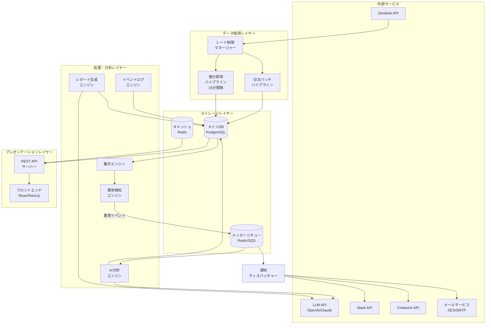

# 技術設計書: Zendesk CSダッシュボード

## 概要

本設計書は、Zendeskチケットデータを活用したCS管理ダッシュボードの技術設計を定義する。「1秒で状況把握 → 5秒で原因当たり → 即アクション」を実現するため、リアルタイムデータパイプライン、AI異常検知・原因分析、マルチチャネル通知、イベントログ管理を統合したシステムを構築する。

### 設計方針

- **レイヤードアーキテクチャ**: データ取得・集計・分析・表示を明確に分離
- **イベント駆動**: 異常検知→AI分析→通知の一連フローを非同期イベントで連携
- **スケーラブル**: バッチ処理と準リアルタイム増分取得の二重パイプライン
- **AI統合**: LLMを活用した原因分析・予測・レポート生成を各所に組み込み
- **セキュリティ**: APIキー管理、データ暗号化、監査ログを標準装備

## アーキテクチャ

### システム全体構成



### レイヤー責務

| レイヤー | 責務 | 主要技術 |
|---------|------|---------|
| データ取得 | Zendesk APIからのデータ取得、レート制限管理、リトライ | Node.js, cron, Zendesk API |
| ストレージ | データ永続化、キャッシュ、メッセージキュー | PostgreSQL, Redis |
| 処理・分析 | 集計、異常検知、AI分析、イベント管理 | Node.js, Python(ML), LLM API |
| プレゼンテーション | REST API、フロントエンドUI | Next.js, React, Recharts |


## コンポーネントとインターフェース

### 1. データ取得パイプライン (Data Pipeline)

#### 1.1 バッチパイプライン (BatchPipeline)

日次で全チケットデータを再集計する。毎日深夜（JST 02:00）に実行。

```typescript
interface BatchPipelineConfig {
  scheduleExpression: string; // cron式: "0 2 * * *"
  zendeskSubdomain: string;
  apiToken: string;
  userEmail: string;
}

interface BatchPipelineResult {
  totalTicketsFetched: number;
  populationCount: number;
  excludedCount: number;
  lastUpdatedAt: Date;
  errors: PipelineError[];
}

class BatchPipeline {
  async execute(): Promise<BatchPipelineResult>;
  async fetchAllTickets(startDate: Date, endDate: Date): Promise<RawTicket[]>;
  async filterPopulation(tickets: RawTicket[]): Promise<FilteredTicket[]>;
  async aggregate(tickets: FilteredTicket[]): Promise<AggregationResult>;
}
```

#### 1.2 増分取得パイプライン (IncrementalPipeline)

15分間隔で更新分のみを取得する。Zendesk Incremental Exports APIを使用。

```typescript
interface IncrementalPipelineConfig {
  intervalMinutes: number; // デフォルト: 15
  cursorStorageKey: string;
}

class IncrementalPipeline {
  async execute(): Promise<IncrementalFetchResult>;
  async fetchIncremental(sinceTimestamp: number): Promise<RawTicket[]>;
  async mergeIntoStore(tickets: RawTicket[]): Promise<MergeResult>;
  async getLastCursor(): Promise<number>;
  async saveCursor(cursor: number): Promise<void>;
}
```

#### 1.3 レート制限マネージャー (RateLimitManager)

```typescript
interface RateLimitState {
  remainingRequests: number;
  resetAt: Date;
  usagePercent: number;
}

class RateLimitManager {
  async checkAndWait(): Promise<void>;
  async updateFromHeaders(headers: ZendeskResponseHeaders): Promise<void>;
  isThrottleRequired(): boolean; // usagePercent >= 80% で true
  getBackoffDelay(retryCount: number): number; // 指数バックオフ
}
```

### 2. 集計エンジン (AggregationEngine)

```typescript
interface AggregationEngine {
  // 日別サマリー (要件2)
  computeDailySummary(date: Date): Promise<DailySummary>;
  
  // 項目別分析 (要件3)
  computeCategoryBreakdown(date: Date): Promise<CategoryBreakdown[]>;
  
  // 日別×項目別マトリクス (要件4)
  computeMatrix(startDate: Date, endDate: Date): Promise<MatrixRow[]>;
  
  // 時間帯分析 (要件5)
  computeHourlyDistribution(startDate: Date, endDate: Date): Promise<HourlyData[]>;
  computeHeatmap(startDate: Date, endDate: Date): Promise<HeatmapData>;
  
  // 母集団フィルタリング (要件1)
  filterPopulation(tickets: RawTicket[]): FilteredTicket[];
}

interface DailySummary {
  date: Date;
  totalCount: number;
  previousDayCount: number;
  dayOverDayDiff: number;
  dayOverDayRate: number; // 増減率 (%)
  avg7Days: number;
  avg30Days: number;
  trend: 'increase' | 'decrease' | 'flat';
}

interface CategoryBreakdown {
  category: string;
  count: number;
  percentage: number;
  previousDayDiff: number;
  previousWeekSameDayDiff: number;
  trend: 'increase' | 'decrease' | 'flat';
  rank: number;
}

interface MatrixRow {
  date: Date;
  totalCount: number;
  categories: { [category: string]: { count: number; percentage: number; diff: number } };
}

interface HeatmapData {
  cells: { dayOfWeek: number; hour: number; count: number }[];
  minCount: number;
  maxCount: number;
}
```

### 3. 異常検知エンジン (AnomalyDetector)

```typescript
interface AnomalyDetectorConfig {
  // 閾値方式 (要件7)
  thresholds: {
    total: number;
    byCategory: { [category: string]: number };
  };
  // トレンドベース方式 (要件8)
  trendConfig: {
    movingAverageDays: number;    // デフォルト: 14
    sigmaMultiplier: number;      // デフォルト: 2.0
    enableDayOfWeekSeasonality: boolean; // デフォルト: true
  };
}

interface AnomalyEvent {
  id: string;
  detectedAt: Date;
  type: 'threshold' | 'trend';
  metric: string;           // "total" or category名
  currentValue: number;
  thresholdOrBaseline: number;
  deviation: number;
  severity: 'warning' | 'critical';
}

class AnomalyDetector {
  // 閾値方式 (要件7)
  checkThreshold(value: number, threshold: number): boolean;
  
  // トレンドベース方式 (要件8)
  computeMovingAverage(values: number[], windowSize: number): number;
  computeDayOfWeekAverage(values: DailyValue[], targetDayOfWeek: number, windowWeeks: number): number;
  computeStandardDeviation(values: number[], mean: number): number;
  checkTrendAnomaly(current: number, mean: number, stdDev: number, sigmaMultiplier: number): boolean;
  
  // 統合検知
  async detect(date: Date): Promise<AnomalyEvent[]>;
}
```

### 4. AI分析エンジン (AIAnalyzer)

```typescript
interface AIAnalysisResult {
  anomalyEventId: string;
  categoryBreakdown: { category: string; count: number; percentage: number; increaseRate: number }[];
  commonPatterns: string;
  hypotheses: CauseHypothesis[];
  representativeTicketIds: string[]; // 最大5件
  eventCorrelation?: EventCorrelationResult;
  generatedAt: Date;
}

interface CauseHypothesis {
  rank: number;
  description: string;
  evidence: { metric: string; value: number; unit: string }[];
  confidence: 'high' | 'medium' | 'low';
}

interface EventCorrelationResult {
  correlatedEvents: { eventId: string; eventName: string; impactScore: number }[];
  summary: string;
}

class AIAnalyzer {
  // 原因分析 (要件10)
  async analyzeCause(anomalyEvent: AnomalyEvent): Promise<AIAnalysisResult>;
  
  // イベント影響度分析 (要件12)
  async computeImpactScore(eventId: string): Promise<ImpactScoreResult>;
  
  // 複数イベント重複分析 (要件13)
  async analyzeOverlappingEvents(eventIds: string[]): Promise<OverlapAnalysisResult>;
  
  // AI自動イベント提案 (要件14)
  async suggestEventRegistration(anomalyEvent: AnomalyEvent): Promise<EventSuggestion | null>;
  
  // イベント相関分析 (要件15)
  async analyzeEventCorrelation(eventId: string): Promise<EventCategoryCorrelation>;
  
  // ナレッジ学習・予測 (要件18)
  async predictImpact(eventType: string, eventTags: string[]): Promise<ImpactPrediction>;
  
  // レポート生成 (要件19)
  async generateReport(period: ReportPeriod): Promise<AutoReport>;
  
  // アクション提案 (要件21)
  async suggestActions(anomalyEvent: AnomalyEvent, analysis: AIAnalysisResult): Promise<ActionSuggestion[]>;
}

interface ImpactScoreResult {
  eventId: string;
  impactScore: number; // 0-100
  preEventAvg: number;
  postEventAvg: number;
  changeRate: number;
  categoryContributions: { category: string; contribution: number }[];
}

interface OverlapAnalysisResult {
  period: { start: Date; end: Date };
  events: { eventId: string; eventName: string; individualImpactScore: number; relativeContribution: number }[];
  ranking: string[];
  summary: string;
}

interface EventSuggestion {
  suggestedEventType: string;
  suggestedDate: Date;
  reason: string;
  analysisSnippet: string;
}

interface ImpactPrediction {
  predictedIncreasePercent: number;
  affectedCategories: { category: string; predictedIncrease: number }[];
  pastSimilarEvents: { eventId: string; eventName: string; impactScore: number; memo: string }[];
  confidenceLevel: 'high' | 'medium' | 'low';
  confidenceReason: string;
}

type ActionType = 
  | 'faq_create_update'
  | 'announcement_post'
  | 'partner_notification'
  | 'internal_escalation'
  | 'template_reply_create'
  | 'system_investigation';

interface ActionSuggestion {
  id: string;
  anomalyEventId: string;
  actionType: ActionType;
  title: string;
  description: string; // 短く、具体的で、すぐ実行可能な文章
  priority: 'high' | 'medium' | 'low';
  reasoning: string; // 根拠となる数値・チケット内容の要約
  relatedCategory?: string;
  responseStatus: 'pending' | 'accepted' | 'deferred' | 'rejected';
  executionStatus?: 'not_started' | 'in_progress' | 'completed';
  effectMetrics?: { preActionCount: number; postActionCount: number; changeRate: number };
  createdAt: Date;
}

class ActionSuggestionEngine {
  async suggest(anomalyEvent: AnomalyEvent, analysis: AIAnalysisResult): Promise<ActionSuggestion[]>;
  async respond(suggestionId: string, response: 'accepted' | 'deferred' | 'rejected'): Promise<void>;
  async updateExecutionStatus(suggestionId: string, status: ActionSuggestion['executionStatus']): Promise<void>;
  async trackEffect(suggestionId: string): Promise<ActionSuggestion['effectMetrics']>;
  async getHistory(anomalyEventId?: string): Promise<ActionSuggestion[]>;
  async getPastEffectiveActions(category: string): Promise<ActionSuggestion[]>;
}
```

### 5. 通知ディスパッチャー (NotificationDispatcher)

```typescript
interface NotificationRule {
  id: string;
  channel: 'slack' | 'email' | 'chatwork';
  destination: string; // チャンネルID, メールアドレス, ルームID
  triggerConditions: TriggerCondition[];
  enabled: boolean;
}

interface NotificationMessage {
  anomalyMetric: string;
  detectedValue: number;
  averageValue: number;
  deviationFromAverage: number;
  topCategories: { category: string; percentage: number }[]; // 上位3項目
  representativeTicketIds: string[]; // 最大5件
  ticketUrls: string[];
  aiAnalysisSummary: string;
}

class NotificationDispatcher {
  async dispatch(message: NotificationMessage, rules: NotificationRule[]): Promise<DispatchResult[]>;
  async sendSlack(destination: string, message: FormattedMessage): Promise<SendResult>;
  async sendEmail(destination: string, message: FormattedMessage): Promise<SendResult>;
  async sendChatwork(destination: string, message: FormattedMessage): Promise<SendResult>;
  async retryWithBackoff(sendFn: () => Promise<SendResult>, maxRetries: number): Promise<SendResult>;
}

interface DispatchResult {
  ruleId: string;
  channel: string;
  success: boolean;
  error?: string;
  retryCount: number;
}
```

### 6. イベントログエンジン (EventLogEngine)

```typescript
interface EventLog {
  id: string;
  name: string;
  eventType: EventType;
  occurredAt: Date;
  description: string;
  tags: string[];
  memo?: string;
  urls: string[];
  impactScore?: number;
  createdAt: Date;
  updatedAt: Date;
}

type EventType = 
  | 'campaign_start'
  | 'system_release'
  | 'incident'
  | 'email_delivery'
  | 'pricing_change'
  | 'terms_change'
  | 'other';

class EventLogEngine {
  async create(input: CreateEventInput): Promise<EventLog>;
  async update(id: string, input: UpdateEventInput): Promise<EventLog>;
  async delete(id: string): Promise<void>;
  async list(filters: EventListFilters): Promise<PaginatedResult<EventLog>>;
  async getById(id: string): Promise<EventLog>;
  async getOverlappingEvents(date: Date, windowDays: number): Promise<EventLog[]>;
  async getByTypeAndTags(eventType?: EventType, tags?: string[]): Promise<EventLog[]>;
}

interface EventListFilters {
  eventTypes?: EventType[];
  tags?: string[];
  startDate?: Date;
  endDate?: Date;
  sortBy?: 'occurredAt' | 'impactScore';
  sortOrder?: 'asc' | 'desc';
}
```

### 7. レポート生成エンジン (ReportGenerator)

```typescript
interface AutoReport {
  id: string;
  period: ReportPeriod;
  startDate: Date;
  endDate: Date;
  content: ReportContent;
  generatedAt: Date;
  distributedAt?: Date;
}

interface ReportContent {
  totalTickets: number;
  previousPeriodComparison: { diff: number; rate: number };
  categoryHighlights: { category: string; count: number; trend: string; changeRate: number }[];
  anomalyEvents: { date: Date; metric: string; summary: string }[];
  eventLogs: { name: string; impactScore: number }[];
  forecast: { predictedCount: number; basis: string };
  narrativeSummary: string; // AI生成テキスト
}

type ReportPeriod = 'weekly' | 'monthly' | 'custom';

class ReportGenerator {
  async generate(period: ReportPeriod, customRange?: DateRange): Promise<AutoReport>;
  async distribute(reportId: string): Promise<DistributionResult[]>;
  async listHistory(page: number, pageSize: number): Promise<PaginatedResult<AutoReport>>;
  async resend(reportId: string): Promise<DistributionResult[]>;
}
```


### 8. カスタムアラートルールエンジン (AlertRuleEngine)

```typescript
interface AlertRule {
  id: string;
  name: string;
  triggerType: 'total_surge' | 'category_surge' | 'hourly_surge';
  conditions: AlertCondition[];
  targetCategory?: string; // category_surgeの場合に指定
  notificationChannels: AlertNotificationChannel[];
  cooldownMinutes: number; // 再通知抑制（デフォルト: 60分）
  enabled: boolean;
  createdAt: Date;
  updatedAt: Date;
}

interface AlertCondition {
  method: 'day_over_day_rate' | 'sigma_deviation' | 'fixed_count';
  // day_over_day_rate: 前日比率（例: 150 = 150%以上で発火）
  // sigma_deviation: 移動平均からのσ偏差（例: 2.0）
  // fixed_count: 固定件数超過（例: 100）
  value: number;
}

interface AlertNotificationChannel {
  channel: 'slack' | 'email' | 'chatwork';
  destination: string;
}

type AlertPresetType = 'total_surge' | 'category_surge' | 'anomaly_detection';

interface AlertFiringRecord {
  id: string;
  alertRuleId: string;
  firedAt: Date;
  detectedValue: number;
  baselineValue: number;
  deviation: number;
  representativeTicketIds: string[];
  status: 'unresolved' | 'in_progress' | 'resolved';
  resolvedAt?: Date;
}

class AlertRuleEngine {
  async create(input: CreateAlertRuleInput): Promise<AlertRule>;
  async createFromPreset(preset: AlertPresetType): Promise<AlertRule>;
  async update(id: string, input: UpdateAlertRuleInput): Promise<AlertRule>;
  async delete(id: string): Promise<void>;
  async list(): Promise<AlertRule[]>;
  async evaluate(date: Date): Promise<AlertFiringRecord[]>;
  async isCooldownActive(ruleId: string): Promise<boolean>;
  async getFiringHistory(filters: AlertHistoryFilters): Promise<PaginatedResult<AlertFiringRecord>>;
  async updateFiringStatus(firingId: string, status: AlertFiringRecord['status']): Promise<void>;
}
```

### 9. REST API設計

#### エンドポイント一覧

| メソッド | パス | 説明 | 対応要件 |
|---------|------|------|---------|
| GET | `/api/dashboard/summary` | 日別サマリー取得 | 要件2 |
| GET | `/api/dashboard/categories` | 項目別分析取得 | 要件3 |
| GET | `/api/dashboard/matrix` | 日別×項目別マトリクス取得 | 要件4 |
| GET | `/api/dashboard/hourly` | 時間帯分析取得 | 要件5 |
| GET | `/api/dashboard/heatmap` | ヒートマップデータ取得 | 要件5 |
| GET | `/api/dashboard/population` | 集計母集団情報取得 | 要件1 |
| GET | `/api/anomalies` | 異常イベント一覧取得 | 要件7,8 |
| GET | `/api/anomalies/:id/analysis` | AI分析結果取得 | 要件10 |
| GET | `/api/anomalies/:id/suggestion` | AI自動イベント提案取得 | 要件14 |
| POST | `/api/anomalies/:id/suggestion/respond` | AI提案への応答 | 要件14 |
| GET/PUT | `/api/settings/thresholds` | 閾値設定の取得・更新 | 要件7 |
| GET/PUT | `/api/settings/trend` | トレンド検知設定の取得・更新 | 要件8 |
| GET/POST/PUT/DELETE | `/api/events` | イベントログCRUD | 要件11 |
| GET | `/api/events/:id/impact` | イベント影響度分析取得 | 要件12 |
| GET | `/api/events/:id/correlation` | イベント相関分析取得 | 要件15 |
| GET | `/api/events/overlap` | 複数イベント重複分析取得 | 要件13 |
| GET | `/api/events/:id/prediction` | ナレッジ予測取得 | 要件18 |
| GET/POST/PUT/DELETE | `/api/notifications/rules` | 通知ルールCRUD | 要件9 |
| GET | `/api/reports` | レポート履歴一覧取得 | 要件19 |
| POST | `/api/reports/generate` | 手動レポート生成 | 要件19 |
| POST | `/api/reports/:id/resend` | レポート再送信 | 要件19 |
| GET/PUT | `/api/settings/reports` | レポート設定の取得・更新 | 要件19 |
| GET | `/api/pipeline/status` | パイプラインステータス取得 | 要件16,17 |
| GET/POST/PUT/DELETE | `/api/alerts/rules` | アラートルールCRUD | 要件20 |
| POST | `/api/alerts/rules/preset` | プリセットからアラートルール作成 | 要件20 |
| GET | `/api/alerts/history` | アラート発火履歴一覧取得 | 要件20 |
| PUT | `/api/alerts/history/:id/status` | アラート対応ステータス更新 | 要件20 |
| GET | `/api/anomalies/:id/actions` | AIアクション提案一覧取得 | 要件21 |
| POST | `/api/anomalies/:id/actions/:actionId/respond` | アクション提案への応答 | 要件21 |
| PUT | `/api/anomalies/:id/actions/:actionId/status` | アクション実行ステータス更新 | 要件21 |
| GET | `/api/anomalies/:id/actions/:actionId/effect` | アクション実行効果取得 | 要件21 |

#### 共通クエリパラメータ

```typescript
interface DateRangeQuery {
  startDate: string;  // ISO 8601 (YYYY-MM-DD)
  endDate: string;    // ISO 8601 (YYYY-MM-DD)
}

// クイック選択プリセット (要件6)
type QuickSelect = 'today' | 'yesterday' | 'this_week' | 'last_week' | 'this_month' | 'last_month';
```

#### レスポンス形式

```typescript
interface ApiResponse<T> {
  success: boolean;
  data: T;
  meta: {
    lastUpdatedAt: string;  // データ最終更新日時
    populationInfo: {
      totalCount: number;
      excludedCount: number;
    };
  };
  error?: {
    code: string;
    message: string;
  };
}
```

## データモデル

### ER図

```mermaid
erDiagram
    TICKETS {
        bigint id PK
        varchar zendesk_ticket_id UK
        timestamp created_at
        timestamp updated_at
        varchar inquiry_category
        varchar ticket_status
        varchar subject
        text description
        boolean is_excluded
        timestamp fetched_at
    }

    DAILY_AGGREGATIONS {
        bigint id PK
        date aggregation_date UK
        integer total_count
        integer excluded_count
        float avg_7days
        float avg_30days
        timestamp computed_at
    }

    CATEGORY_AGGREGATIONS {
        bigint id PK
        date aggregation_date
        varchar inquiry_category
        integer count
        float percentage
        integer prev_day_diff
        integer prev_week_same_day_diff
        timestamp computed_at
    }

    HOURLY_AGGREGATIONS {
        bigint id PK
        date aggregation_date
        smallint hour
        smallint day_of_week
        integer count
        timestamp computed_at
    }

    ANOMALY_EVENTS {
        uuid id PK
        timestamp detected_at
        varchar detection_type
        varchar metric
        float current_value
        float baseline_value
        float deviation
        varchar severity
        boolean is_acknowledged
        timestamp created_at
    }

    AI_ANALYSES {
        uuid id PK
        uuid anomaly_event_id FK
        jsonb category_breakdown
        text common_patterns
        jsonb hypotheses
        jsonb representative_ticket_ids
        jsonb event_correlation
        timestamp generated_at
    }

    EVENT_LOGS {
        uuid id PK
        varchar name
        varchar event_type
        timestamp occurred_at
        text description
        text memo
        jsonb urls
        jsonb tags
        float impact_score
        timestamp created_at
        timestamp updated_at
    }

    EVENT_TAGS {
        bigint id PK
        varchar name UK
        boolean is_default
        timestamp created_at
    }

    NOTIFICATION_RULES {
        uuid id PK
        varchar channel
        varchar destination
        jsonb trigger_conditions
        boolean enabled
        timestamp created_at
        timestamp updated_at
    }

    NOTIFICATION_LOGS {
        uuid id PK
        uuid notification_rule_id FK
        uuid anomaly_event_id FK
        varchar channel
        varchar status
        integer retry_count
        text error_message
        timestamp sent_at
    }

    ANOMALY_SETTINGS {
        uuid id PK
        jsonb thresholds
        integer moving_average_days
        float sigma_multiplier
        boolean day_of_week_seasonality
        timestamp updated_at
    }

    AUTO_REPORTS {
        uuid id PK
        varchar period
        date start_date
        date end_date
        jsonb content
        text narrative_summary
        timestamp generated_at
        timestamp distributed_at
    }

    REPORT_SETTINGS {
        uuid id PK
        jsonb schedule
        jsonb distribution_channels
        timestamp updated_at
    }

    PIPELINE_STATE {
        varchar id PK
        bigint last_incremental_cursor
        timestamp last_batch_run_at
        timestamp last_incremental_run_at
        jsonb data_source_status
        timestamp updated_at
    }

    AI_EVENT_SUGGESTIONS {
        uuid id PK
        uuid anomaly_event_id FK
        varchar suggested_event_type
        timestamp suggested_date
        text reason
        varchar response_status
        timestamp created_at
    }

    ALERT_RULES {
        uuid id PK
        varchar name
        varchar trigger_type
        jsonb conditions
        varchar target_category
        jsonb notification_channels
        integer cooldown_minutes
        boolean enabled
        timestamp created_at
        timestamp updated_at
    }

    ALERT_FIRING_RECORDS {
        uuid id PK
        uuid alert_rule_id FK
        timestamp fired_at
        float detected_value
        float baseline_value
        float deviation
        jsonb representative_ticket_ids
        varchar status
        timestamp resolved_at
        timestamp created_at
    }

    ACTION_SUGGESTIONS {
        uuid id PK
        uuid anomaly_event_id FK
        varchar action_type
        varchar title
        text description
        varchar priority
        text reasoning
        varchar related_category
        varchar response_status
        varchar execution_status
        jsonb effect_metrics
        timestamp created_at
        timestamp updated_at
    }

    TICKETS ||--o{ CATEGORY_AGGREGATIONS : "集計"
    DAILY_AGGREGATIONS ||--o{ CATEGORY_AGGREGATIONS : "日別内訳"
    ANOMALY_EVENTS ||--o| AI_ANALYSES : "分析"
    ANOMALY_EVENTS ||--o{ NOTIFICATION_LOGS : "通知"
    NOTIFICATION_RULES ||--o{ NOTIFICATION_LOGS : "ルール適用"
    ANOMALY_EVENTS ||--o| AI_EVENT_SUGGESTIONS : "提案"
    ALERT_RULES ||--o{ ALERT_FIRING_RECORDS : "発火履歴"
    ANOMALY_EVENTS ||--o{ ACTION_SUGGESTIONS : "アクション提案"
```



### 主要テーブル定義

#### tickets テーブル
チケットの生データを格納。Zendesk APIから取得したデータを正規化して保存。

- `is_excluded`: Ticket_Statusが "Z" または "Z :" で始まる場合に `true`
- `zendesk_ticket_id`: Zendesk上のチケットID（一意制約）
- インデックス: `(created_at, is_excluded)`, `(inquiry_category, created_at)`

#### daily_aggregations テーブル
日別の集計結果をキャッシュ。バッチ処理および増分取得時に更新。

- `aggregation_date`: 一意制約（1日1レコード）
- 7日平均・30日平均は集計時に計算して格納

#### category_aggregations テーブル
日別×項目別の集計結果。マトリクスビューおよび項目別分析に使用。

- 複合一意制約: `(aggregation_date, inquiry_category)`
- 前日差・前週同曜日差は集計時に計算して格納

#### event_logs テーブル
ビジネスイベントの記録。タグはJSONB配列で格納。

- `event_type`: ENUM型（7種別）
- `tags`: JSONB配列（複数タグ対応）
- `urls`: JSONB配列（複数URL対応）
- `impact_score`: AI_Analyzerが自動算出（0〜100）


## 正当性プロパティ (Correctness Properties)

*プロパティとは、システムの全ての有効な実行において真であるべき特性や振る舞いのことである。人間が読める仕様と機械で検証可能な正当性保証の橋渡しとなる形式的な記述である。*

### Property 1: 母集団フィルタの正確性

*任意の*チケットに対して、そのTicket_Statusが "Z" で始まる、または "Z :" で始まる場合にのみ、`filterPopulation`関数は当該チケットを除外（`is_excluded = true`）とする。それ以外のチケットは全て集計対象に含まれる。

**Validates: Requirements 1.2, 1.3**

### Property 2: 除外件数の整合性

*任意の*チケット集合に対して、`filterPopulation`が返す除外件数は、実際にフィルタで除外されたチケットの数と一致する。また、除外件数 + 集計対象件数 = 全チケット件数が成立する。

**Validates: Requirements 1.5**

### Property 3: 前日比の計算正確性

*任意の*2つの連続する日のチケット件数（today, yesterday）に対して、前日比の件数差は `today - yesterday`、増減率は `(today - yesterday) / yesterday * 100` と一致する（yesterday = 0の場合は特別処理）。

**Validates: Requirements 2.2**

### Property 4: N日平均の計算正確性

*任意の*N個の日別チケット件数に対して、N日平均は当該N個の値の合計をNで割った値と一致する。

**Validates: Requirements 2.3, 2.4**

### Property 5: トレンド分類の正確性

*任意の*差分値に対して、トレンド分類関数は正の値を `'increase'`、負の値を `'decrease'`、ゼロを `'flat'` と分類する。

**Validates: Requirements 2.5, 2.6, 2.7, 3.7, 3.8, 4.3, 4.4**

### Property 6: カテゴリ別集計の整合性

*任意の*チケット集合に対して、カテゴリ別の件数合計は全体合計と一致し、カテゴリ別の割合の合計は100%（丸め誤差±1%以内）となる。

**Validates: Requirements 3.1, 3.2**

### Property 7: カテゴリランキングのソート不変量

*任意の*カテゴリ別集計結果に対して、ランキングは件数の降順でソートされている。すなわち、rank[i]の件数 >= rank[i+1]の件数が全てのiで成立する。

**Validates: Requirements 3.5**

### Property 8: 上位5項目+その他の集約ルール

*任意の*6種類を超えるカテゴリを持つ集計結果に対して、出力は正確に6エントリ（上位5個別 + 1「その他」）となり、「その他」の件数は6位以降の全カテゴリの件数合計と一致する。

**Validates: Requirements 3.6**

### Property 9: マトリクス行の合計不変量

*任意の*マトリクス行に対して、その行の全カテゴリ件数の合計は、当該日のチケット合計件数と一致する。

**Validates: Requirements 4.1, 4.2**

### Property 10: 時間帯別集計の正確性

*任意の*チケット集合に対して、時間帯別（0〜23時）の件数合計は全体合計と一致し、各時間帯の件数は0以上である。

**Validates: Requirements 5.1**

### Property 11: ヒートマップデータの正確性

*任意の*チケット集合に対して、ヒートマップの7×24マトリクスの全セル件数合計は全体合計と一致し、minCountは全セルの最小値、maxCountは全セルの最大値と一致する。

**Validates: Requirements 5.2**

### Property 12: クイック選択の日付範囲計算

*任意の*基準日と*任意の*クイック選択プリセット（today/yesterday/this_week/last_week/this_month/last_month）に対して、計算された日付範囲の開始日は終了日以前であり、各プリセットの定義に従った正しい範囲を返す。

**Validates: Requirements 6.2**

### Property 13: 閾値異常検知の正確性

*任意の*値としきい値のペアに対して、`checkThreshold`関数は値 > しきい値の場合にのみ `true` を返す。

**Validates: Requirements 7.1, 7.2, 7.3**

### Property 14: 移動平均の計算正確性

*任意の*数値配列とウィンドウサイズNに対して、移動平均は直近N個の値の合計をNで割った値と一致する。

**Validates: Requirements 8.3**

### Property 15: σ偏差異常検知の正確性

*任意の*現在値・平均値・標準偏差・σ倍数に対して、`checkTrendAnomaly`関数は `|current - mean| >= sigmaMultiplier * stdDev` の場合にのみ `true` を返す。

**Validates: Requirements 8.1, 8.2, 8.5**

### Property 16: 通知メッセージの完全性

*任意の*NotificationMessageに対して、フォーマットされた通知出力は、異常指標名・検知値・平均値・平均との差分・上位3カテゴリ（各割合付き）・代表チケットID（最大5件）・AI分析要約を全て含む。

**Validates: Requirements 9.4, 9.5, 9.6, 9.7, 9.9**

### Property 17: ZendeskチケットURL生成の正確性

*任意の*チケットIDとZendeskサブドメインに対して、生成されるURLは `https://{subdomain}.zendesk.com/agent/tickets/{ticketId}` の形式と一致する。

**Validates: Requirements 9.8**

### Property 18: 指数バックオフリトライの正確性

*任意の*リトライ回数nに対して、バックオフ遅延は `baseDelay * 2^n` と一致し、最大リトライ回数を超えた場合はリトライを停止する。

**Validates: Requirements 9.10, 16.5**

### Property 19: AI分析出力の制約不変量

*任意の*AI分析結果に対して、原因仮説は最大3件、各仮説は1つ以上の数値根拠を持ち、代表チケットIDは最大5件であり、カテゴリ寄与度の合計は100%（±1%以内）となる。

**Validates: Requirements 10.2, 10.4, 10.5, 10.6**

### Property 20: Impact_Scoreの計算と範囲制約

*任意の*イベントとその前後3日間のチケットデータに対して、Impact_Scoreは変化率とカテゴリ寄与度から算出され、0〜100の範囲に収まる。

**Validates: Requirements 12.1, 12.2, 12.3, 12.5**

### Property 21: 重複イベント検出と寄与度合計

*任意の*イベント集合に対して、前後3日のウィンドウが重複するイベントが正しく検出され、重複イベントの相対寄与度の合計は100%（±1%以内）となる。

**Validates: Requirements 13.1, 13.5**

### Property 22: イベント提案トリガーと抑制ロジック

*任意の*異常イベントに対して、該当期間に登録済みイベントが存在しない場合にのみ提案が生成される。また、「無視する」が選択された異常イベントに対しては再提案が生成されない。

**Validates: Requirements 14.1, 14.5**

### Property 23: イベントフィルタとタグバリデーション

*任意の*イベント集合とフィルタ条件に対して、フィルタ結果は条件に合致するイベントのみを含む。また、*任意の*イベント作成入力に対して、タグが空の場合はバリデーションエラーとなる。

**Validates: Requirements 11.8, 11.10**

### Property 24: カーソルベース増分取得の正確性

*任意の*カーソルタイムスタンプに対して、増分取得はカーソル以降に更新されたチケットのみを返す。返されたチケットの全ての`updated_at`はカーソルタイムスタンプより後である。

**Validates: Requirements 16.3**

### Property 25: レート制限スロットリングの発動条件

*任意の*API使用率に対して、使用率が80%以上の場合にのみスロットリングが有効化される。80%未満の場合はスロットリングは無効である。

**Validates: Requirements 16.4**

### Property 26: 類似イベント検索と信頼度判定

*任意の*イベントタイプとタグに対して、類似イベント検索は同一タイプまたは重複タグを持つ過去イベントを返す。また、同種イベントが2件未満の場合、予測の信頼度は `'low'` となる。

**Validates: Requirements 18.2, 18.7**

### Property 27: レポートコンテンツの完全性

*任意の*自動レポートに対して、コンテンツはチケット合計・前期間比較・カテゴリハイライト・異常イベント一覧・イベントログ一覧・予測の全フィールドを含む。

**Validates: Requirements 19.2, 19.3, 19.4, 19.5, 19.6**

### Property 28: レポートスケジュール計算の正確性

*任意の*日付に対して、週次レポートは月曜日に、月次レポートは1日に生成されるべきと判定される。

**Validates: Requirements 19.1**

### Property 29: アラートルール条件評価の正確性

*任意の*アラートルールと検知値に対して、条件メソッドが `day_over_day_rate` の場合は前日比率が設定値以上、`sigma_deviation` の場合は移動平均からのσ偏差が設定値以上、`fixed_count` の場合は件数が設定値超過の場合にのみアラートが発火する。

**Validates: Requirements 20.1, 20.2**

### Property 30: アラートクールダウン抑制の正確性

*任意の*アラートルールと発火履歴に対して、最後の発火からcooldownMinutes以内の場合は再発火が抑制される。cooldownMinutes経過後は再発火が許可される。

**Validates: Requirements 20.5**

### Property 31: アラート通知メッセージの完全性

*任意の*アラート発火レコードに対して、通知メッセージはルール名・条件・検知値・基準値との差分・代表チケット番号（最大5件）・Zendeskリンクを全て含む。

**Validates: Requirements 20.6, 20.7**

### Property 32: アクション提案の制約不変量

*任意の*異常イベントに対して、AIアクション提案は最大5件であり、各提案は有効なActionType・優先度（high/medium/low）・推奨理由（空でない文字列）を持つ。

**Validates: Requirements 21.1, 21.2, 21.3**

### Property 33: アクション提案の応答ステータス遷移

*任意の*アクション提案に対して、応答ステータスは `pending` → `accepted` / `deferred` / `rejected` のいずれかにのみ遷移する。`accepted` の場合のみ実行ステータス（not_started → in_progress → completed）が設定可能である。

**Validates: Requirements 21.5, 21.6**


## エラーハンドリング

### エラー分類

| カテゴリ | エラー種別 | 対応方針 |
|---------|-----------|---------|
| データ取得 | Zendesk API接続エラー | 指数バックオフで最大5回リトライ。全リトライ失敗時はエラーログ記録＋管理者通知 |
| データ取得 | レート制限超過 | 使用率80%でスロットリング開始。429応答時はRetry-Afterヘッダーに従い待機 |
| データ取得 | 認証エラー (401/403) | リトライせず即座にエラーログ記録＋管理者通知。APIトークン再設定を促す |
| データ処理 | 集計データ不整合 | 不整合検出時はバッチ再実行をスケジュール。前回正常データをフォールバック表示 |
| AI分析 | LLM API接続エラー | 最大3回リトライ。失敗時は「分析不可」を表示し、数値データのみ提供 |
| AI分析 | LLM応答タイムアウト (30秒) | ローディング表示を継続。60秒超過で「分析タイムアウト」表示＋再試行ボタン |
| AI分析 | LLM応答フォーマット不正 | パース失敗時はフォールバックテンプレートで数値ベースの分析結果を生成 |
| 通知配信 | Slack/Chatwork/メール送信失敗 | 最大3回リトライ（指数バックオフ）。全失敗時はエラーログ記録 |
| 通知配信 | 宛先不正 | バリデーションエラーとして記録。該当ルールを無効化し管理者に通知 |
| フロントエンド | API応答エラー | エラーメッセージ表示＋リトライボタン。キャッシュデータがあればフォールバック表示 |
| フロントエンド | データ読み込みタイムアウト | スケルトンUI表示後、タイムアウトメッセージ＋リトライボタン |

### リトライ戦略

```typescript
interface RetryConfig {
  maxRetries: number;
  baseDelayMs: number;
  maxDelayMs: number;
  backoffMultiplier: number; // 2 (指数バックオフ)
}

// デフォルト設定
const DEFAULT_RETRY_CONFIGS: Record<string, RetryConfig> = {
  zendeskApi: { maxRetries: 5, baseDelayMs: 1000, maxDelayMs: 60000, backoffMultiplier: 2 },
  llmApi:     { maxRetries: 3, baseDelayMs: 2000, maxDelayMs: 30000, backoffMultiplier: 2 },
  notification: { maxRetries: 3, baseDelayMs: 1000, maxDelayMs: 15000, backoffMultiplier: 2 },
};

function computeBackoffDelay(retryCount: number, config: RetryConfig): number {
  const delay = config.baseDelayMs * Math.pow(config.backoffMultiplier, retryCount);
  return Math.min(delay, config.maxDelayMs);
}
```

### グレースフルデグラデーション

- AI分析が利用不可の場合: 数値データ（カテゴリ別件数・増減率）のみ表示
- 増分取得が失敗した場合: 前回取得データを表示し、「データ更新遅延中」バナーを表示
- 通知配信が全チャネル失敗の場合: ダッシュボード上のインアプリ通知にフォールバック

## テスト戦略

### テストアプローチ

本プロジェクトでは、ユニットテストとプロパティベーステストの二重アプローチを採用する。

- **ユニットテスト**: 具体的な入出力例、エッジケース、エラー条件の検証
- **プロパティベーステスト**: 全入力に対して成立すべき普遍的プロパティの検証

両者は相補的であり、ユニットテストが具体的なバグを捕捉し、プロパティベーステストが一般的な正当性を保証する。

### プロパティベーステスト設定

- **ライブラリ**: [fast-check](https://github.com/dubzzz/fast-check) (TypeScript/JavaScript向け)
- **最小反復回数**: 各プロパティテストにつき100回以上
- **タグ形式**: `Feature: zendesk-cs-dashboard, Property {number}: {property_text}`
- **各正当性プロパティは1つのプロパティベーステストで実装する**

### テスト対象マッピング

| テスト種別 | 対象コンポーネント | テスト内容 |
|-----------|------------------|-----------|
| プロパティテスト | filterPopulation | Property 1: 母集団フィルタ |
| プロパティテスト | AggregationEngine | Property 2-11: 集計ロジック全般 |
| プロパティテスト | QuickSelectResolver | Property 12: 日付範囲計算 |
| プロパティテスト | AnomalyDetector | Property 13-15: 異常検知ロジック |
| プロパティテスト | NotificationFormatter | Property 16-17: 通知メッセージ |
| プロパティテスト | RetryHandler | Property 18: リトライロジック |
| プロパティテスト | AIAnalyzer (出力検証) | Property 19: AI出力制約 |
| プロパティテスト | ImpactScoreCalculator | Property 20: Impact_Score計算 |
| プロパティテスト | OverlapDetector | Property 21: 重複イベント検出 |
| プロパティテスト | EventSuggestionEngine | Property 22: 提案ロジック |
| プロパティテスト | EventLogEngine | Property 23: フィルタ・バリデーション |
| プロパティテスト | IncrementalPipeline | Property 24: 増分取得 |
| プロパティテスト | RateLimitManager | Property 25: レート制限 |
| プロパティテスト | KnowledgeSearch | Property 26: 類似検索 |
| プロパティテスト | ReportGenerator | Property 27-28: レポート生成 |
| プロパティテスト | AlertRuleEngine | Property 29: アラート条件評価 |
| プロパティテスト | AlertRuleEngine | Property 30: クールダウン抑制 |
| プロパティテスト | AlertNotificationFormatter | Property 31: アラート通知メッセージ |
| プロパティテスト | ActionSuggestionEngine | Property 32: アクション提案制約 |
| プロパティテスト | ActionSuggestionEngine | Property 33: 応答ステータス遷移 |
| ユニットテスト | REST API | 各エンドポイントの正常系・異常系レスポンス |
| ユニットテスト | EventLogEngine | CRUD操作、デフォルトタグ存在確認 |
| ユニットテスト | Data_Pipeline | フィールド取得確認、データソースステータス |
| ユニットテスト | NotificationDispatcher | チャネル別送信、リトライ動作 |
| 統合テスト | データパイプライン全体 | Zendesk API → DB → 集計 → 表示の一連フロー |
| 統合テスト | 異常検知→通知フロー | 異常検知 → AI分析 → 通知配信の一連フロー |
| E2Eテスト | ダッシュボードUI | 主要画面の表示・操作・フィルタ動作 |

### ユニットテスト重点項目

- 期間フィルタのデフォルト値（「今日」）の確認
- EventType列挙型の7種別存在確認
- デフォルトEvent_Tagの存在確認
- マトリクスの日付降順初期ソート
- AI提案の3択応答オプション存在確認
- Zendesk APIフィールド取得仕様の確認

### セキュリティ考慮事項

| 項目 | 対策 |
|------|------|
| APIキー管理 | 環境変数またはシークレットマネージャー（AWS Secrets Manager等）で管理。コードにハードコードしない |
| Zendesk APIトークン | サーバーサイドのみで使用。フロントエンドに露出させない |
| LLM APIキー | サーバーサイドのみで使用。リクエストログにキーを含めない |
| 通知先情報 | DB暗号化（AES-256）で保存。表示時はマスキング |
| チケットデータ | 顧客の個人情報を含む可能性があるため、アクセス制御（RBAC）を実装 |
| AI分析入力 | LLMに送信するチケットデータから個人情報をマスキング処理 |
| 監査ログ | 設定変更・データアクセスの操作ログを記録 |
| HTTPS | 全通信をTLS 1.2以上で暗号化 |
| CORS | 許可オリジンをホワイトリスト管理 |
| 入力バリデーション | 全APIエンドポイントでリクエストパラメータのバリデーションを実施 |
